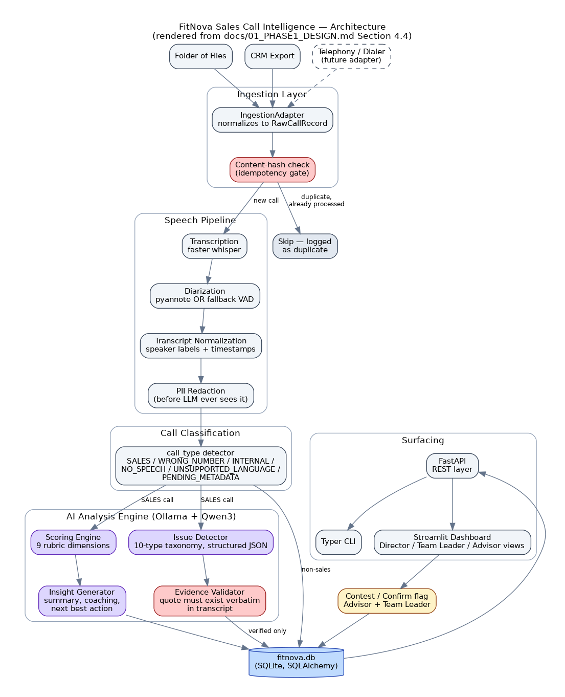

# FitNova Sales Call Intelligence


AI-powered pipeline that ingests, transcribes, diarizes, scores, and flags
issues in sales calls, and surfaces the results through a REST API, a
CLI, and a role-based Streamlit dashboard — entirely on your own machine.

**Status: Release Candidate v1.0.** Every stage described below is a real,
working implementation: a recording dropped in the audio inbox can be
ingested, transcribed, scored, tagged with evidence-grounded issues, and
viewed on the dashboard or pulled via the API, end to end, locally.

<p align="center">
  
</p>

## Contents

- [Quick start](#quick-start)
- [What exists](#what-exists)
- [Running it](#running-it)
- [What's real vs. what's a documented placeholder](#whats-real-vs-whats-a-documented-placeholder)
- [Architecture](#architecture)
- [Documentation](#documentation)
- [Project structure](#project-structure)

## Quick start

Full platform-specific instructions: [`docs/SETUP_WINDOWS.md`](docs/SETUP_WINDOWS.md) ·
[`docs/SETUP_LINUX.md`](docs/SETUP_LINUX.md).

```bash
git clone <this-repo-url> fitnova && cd fitnova
python -m venv .venv && source .venv/bin/activate   # Windows: .venv\Scripts\Activate.ps1
pip install -r requirements.txt
pip install -e .                                      # registers the `fitnova` CLI command
cp .env.example .env                                 # Windows: copy .env.example .env
python -m fitnova.bootstrap
pytest                                                # 220 tests
python -m scripts.seed_demo_data
fitnova doctor
fitnova dashboard
```

`requirements.txt` installs from prebuilt wheels only — it always succeeds,
on Windows included. Processing **real audio** with the default
`DIARIZATION_BACKEND=fallback` additionally needs the speech extras
(`webrtcvad`, a C extension with no prebuilt Windows wheel):

```bash
pip install -r requirements-speech.txt   # Windows: needs MS C++ Build Tools; see docs/SETUP_WINDOWS.md
```

Skipping it is fine — the CLI, API, and dashboard all start normally, and
`fitnova doctor` reports whether the speech extras are installed. Only
`fitnova ingest`/`fitnova analyze` on real audio need it, same as Ollama.

A local [Ollama](https://ollama.com) server with `.env`'s `OLLAMA_MODEL`
(default `qwen3:8b`) pulled is required for `fitnova analyze` — everything
else works without it. `fitnova doctor` tells you exactly what's reachable
in your environment.

## What exists

- `config/` — externalized scoring weights (9-dimension rubric) and issue
  taxonomy (10 types), YAML, schema-validated at bootstrap
- `src/fitnova/core/` — settings, logging, DI container, closed enums
- `src/fitnova/db/` — 16-table SQLAlchemy schema, session management,
  schema bootstrap, the shared repository/query layer
- `src/fitnova/schemas/` — Pydantic I/O contracts, per entity and composite
- `src/fitnova/ingestion/` — pluggable source adapters, idempotent by
  content hash (folder watcher shipped; CRM stub for future sources)
- `src/fitnova/transcription/` — `faster-whisper` with automatic
  model-size fallback
- `src/fitnova/diarization/` — `pyannote.audio` wrapper (optional) + a
  deterministic VAD-based fallback
- `src/fitnova/processing/` — transcript normalization, PII redaction,
  rule-based call classification
- `src/fitnova/analysis/` — Ollama-backed LLM client (structured,
  versioned, retried, observed), scoring engine, issue detector,
  evidence validator, insight generator, confidence calibration
- `src/fitnova/pipeline/` — processing queue, benchmarking, speech
  pipeline orchestrator, analysis orchestrator
- `src/fitnova/reporting/` — CSV/PDF report generation, shared by the API
  and the dashboard
- `src/fitnova/api/` — FastAPI app: calls, org hierarchy, analytics,
  issues/feedback, observability, export (22 endpoints)
- `src/fitnova/cli/` — Typer CLI: `ingest`, `analyze`, `status`,
  `dashboard`, `export`, `benchmark`, `doctor`
- `dashboard/` — Streamlit dashboard: Home, Executive Analytics, Advisor
  Scorecards, Issue Drilldown, Transcript & Evidence Replay,
  Observability & Health
- `scripts/` — demo dataset seeding, demo audio generation, an end-to-end
  narrated demo script, and release-engineering capture tools
- `tests/` — 220 tests covering every layer above (unit + integration +
  API + CLI + dashboard smoke tests)

Everything is real and runs locally: Whisper via `faster-whisper`, the
LLM via a local Ollama server, SQLite for storage. Nothing is hardcoded or
fabricated — every score, issue, and dashboard number is computed from
what's actually in the database.

## Running it

```bash
# 1. Drop audio files (+ optional .meta.json sidecars with advisor_external_id)
#    into data/audio/inbox/, then:
fitnova ingest                     # transcribe, diarize, classify, benchmark
fitnova analyze                    # score, tag issues, generate coaching insight (needs Ollama)

# 2. Check on things
fitnova status                     # processing queue snapshot
fitnova benchmark                  # pipeline timing / Real Time Factor
fitnova doctor                     # health check: config, DB, prompts, Ollama reachability

# 3. Explore the results
fitnova dashboard                  # Streamlit dashboard on http://localhost:8501
uvicorn fitnova.api.main:app --reload --port 8000   # REST API + docs at /docs

# 4. Export
fitnova export calls-csv --output calls.csv
fitnova export scorecard-pdf --advisor-id 1 --output scorecard.pdf
```

`fitnova ingest --watch` keeps re-scanning the inbox on an interval
instead of running once. No recordings of your own yet? Run
`python -m scripts.seed_demo_data` for a small demo dataset, or
`python -m scripts.demo` for a full narrated end-to-end run.

## What's real vs. what's a documented placeholder

- **Real:** the entire speech pipeline (Whisper transcription with
  automatic model fallback, diarization with a deterministic fallback,
  PII redaction, rule-based classification), the entire LLM analysis
  pipeline (structured/versioned/retried Ollama calls, evidence-grounded
  issue validation, confidence calibration), the full database, the REST
  API, the CLI, and the dashboard — all of it runs against real data with
  no mocking in the actual runtime code (tests mock external services like
  Ollama/Whisper model downloads for hermeticity, never the app code).
- **Placeholder:** authentication. `fitnova.api.deps.get_current_role`
  reads an `X-Role` header with no token verification — it exists as the
  seam real auth (OAuth2/JWT) would plug into, not a security boundary.
  The dashboard's role selector is a UI convenience over the same
  placeholder, not enforcement.

See [`RELEASE_NOTES.md`](RELEASE_NOTES.md) for the complete list of known
limitations and [`docs/FINAL_PROJECT_REPORT.md`](docs/FINAL_PROJECT_REPORT.md)
for the design decisions and trade-offs behind each one.

## Architecture

The dashboard reads from `fitnova.db.repository` directly (not over HTTP)
for simplicity in a local single-user setup; the API and CLI are
independent front doors onto that same repository layer, so a number can
never disagree between the three surfaces.

<p align="center">
  
</p>

See [`docs/01_PHASE1_DESIGN.md`](docs/01_PHASE1_DESIGN.md) Section 4 for
the full set of Mermaid diagrams (data flow, idempotency sequence,
deployment, component) and the requirement-traceability matrix.

## Documentation

| Doc | What's in it |
|---|---|
| [`docs/01_PHASE1_DESIGN.md`](docs/01_PHASE1_DESIGN.md) | Requirements traceability, architecture diagrams, DB ERD, scoring rubric, issue taxonomy, hallucination-prevention design |
| [`docs/FINAL_PROJECT_REPORT.md`](docs/FINAL_PROJECT_REPORT.md) | Architecture summary, design decisions, trade-offs, limitations, future improvements |
| [`docs/SETUP_WINDOWS.md`](docs/SETUP_WINDOWS.md) / [`docs/SETUP_LINUX.md`](docs/SETUP_LINUX.md) | Platform-specific setup, troubleshooting |
| [`docs/DEMO_VIDEO_SCRIPT.md`](docs/DEMO_VIDEO_SCRIPT.md) | Scene-by-scene guide for recording a walkthrough |
| [`docs/screenshots/`](docs/screenshots/) | Real CLI/API terminal captures + dashboard page previews |
| [`docs/RELEASE_CHECKLIST.md`](docs/RELEASE_CHECKLIST.md) | What's been verified for this release |
| [`CHANGELOG.md`](CHANGELOG.md) | Change history by phase |
