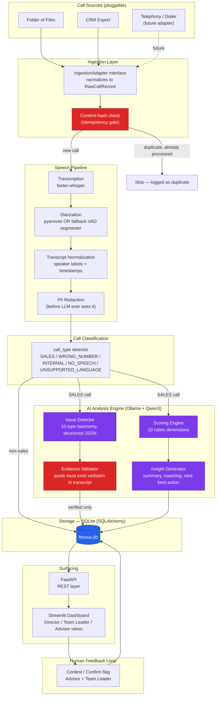
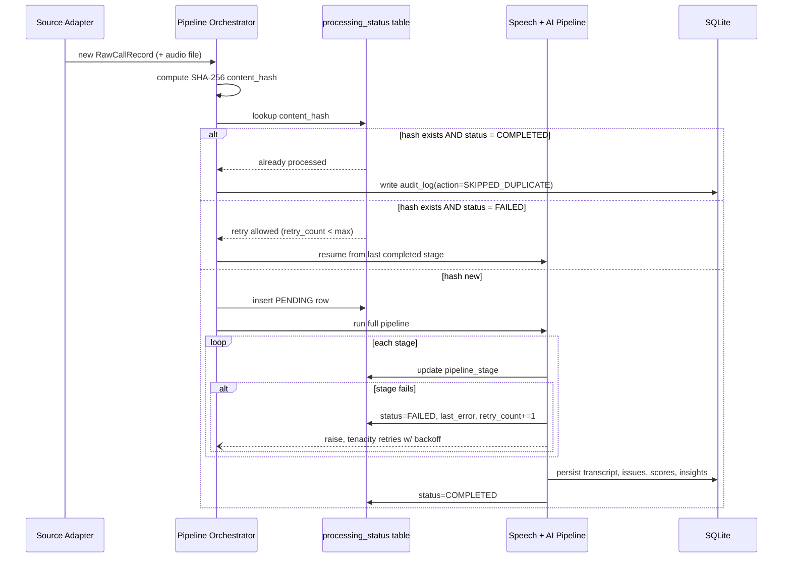
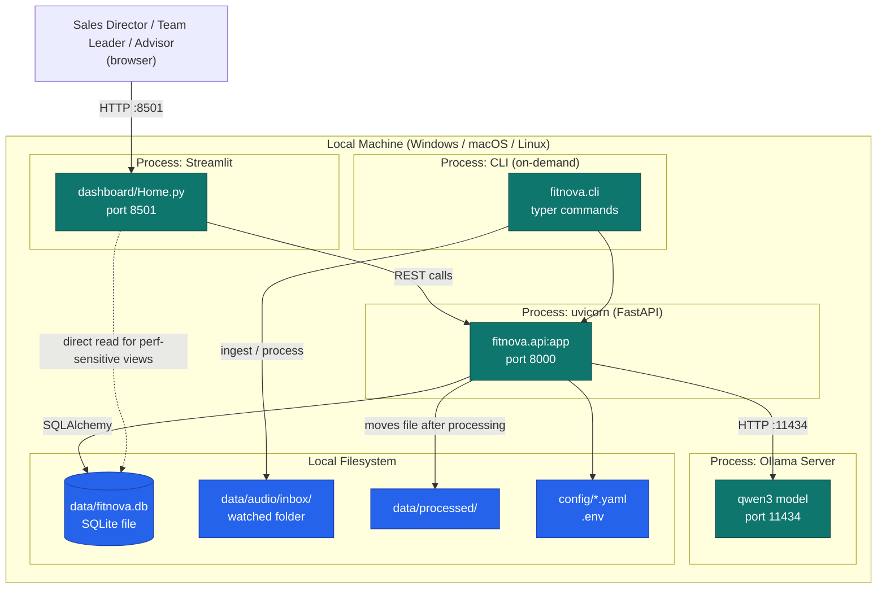
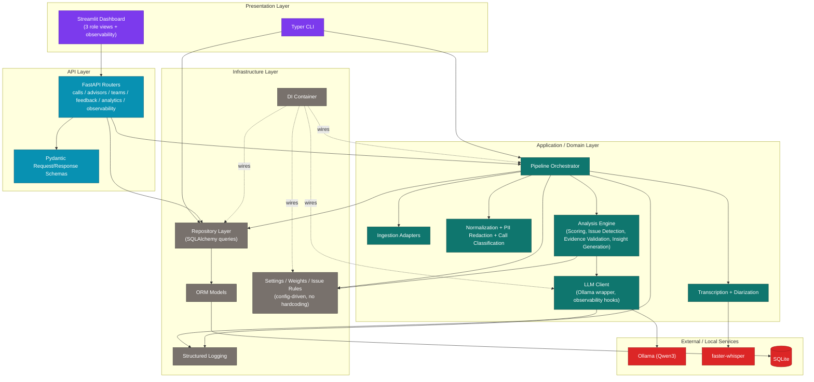
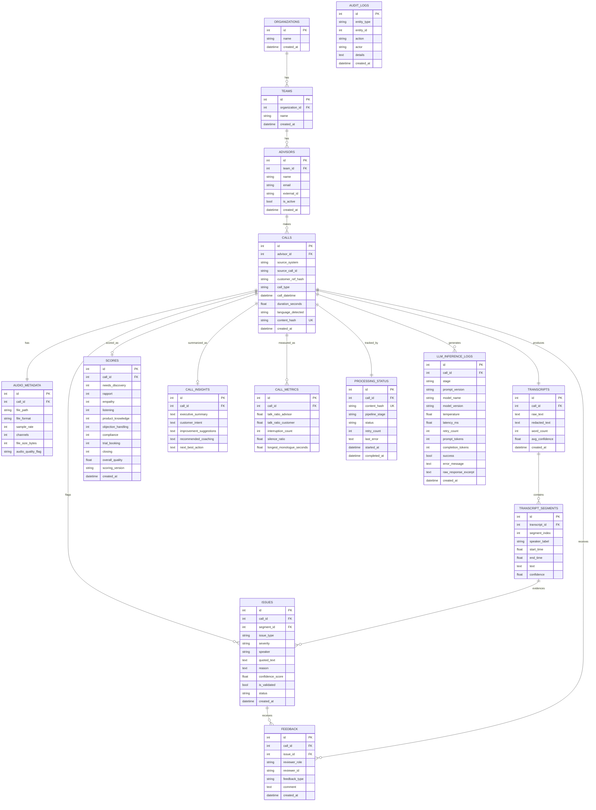

# FitNova Sales Call Intelligence — Phase 1: Requirements, Architecture & Design

**Status:** Design phase — no implementation code yet.
**Source of truth:** `AI_Engineer_Intern_Assignment_1.pdf` (AI Engineer Intern Take-Home Case Study, FitNova)
**Author:** AI Engineering (design pass)
**Date:** 2026-07-09

---

## 1. Purpose of this document

This document is the design contract for the project. Every requirement in the assignment is
mapped to a concrete system component before a single line of implementation code is written.
Phase 2+ implementation must trace back to a row in Section 2. If a component exists that isn't
in that table, or a requirement has no component, that's a bug in the design, not just the code.

---

## 2. Requirement → Component Traceability Matrix

### 2A. System Design (Assignment Section A)

| # | Requirement (from PDF) | System Component | Notes |
|---|---|---|---|
| A1 | Ingestion: get recordings + metadata out of the call source (telephony, dialer, CRM export, or folder of files) | `src/fitnova/ingestion/` — `AudioSourceAdapter` interface + `FolderSourceAdapter`, `CRMSourceAdapter` (stub) | Adapter pattern proves source-agnosticism without needing a real telephony vendor |
| A2 | Source-agnostic ingestion — new vendor pluggable without code changes to the pipeline | `IngestionAdapter` ABC + adapter registry keyed by config, normalized `RawCallRecord` DTO | Only a new adapter class is added; orchestrator, DB, and analysis never change |
| A3 | Transcription and diarisation — audio → text, separate Advisor from Customer | `transcription/whisper_engine.py` (faster-whisper) + `diarization/pyannote_engine.py` with `diarization/fallback_engine.py` | Fallback documented in Section 9 |
| A4 | Analysis — score call quality, flag issues | `analysis/scoring_engine.py`, `analysis/issue_detector.py` | LLM via Ollama/Qwen3, grounded in transcript |
| A5 | Storage — where transcripts, tags, scores, metadata live | SQLite via SQLAlchemy, schema in Section 5 | Normalized, FK-enforced, portable to Postgres later |
| A6 | Surfacing — dashboards | `dashboard/` Streamlit app, 3 role-based views | Backed by FastAPI, not direct DB access from UI |
| A7 | Feedback — how humans correct the system, how it loops back | `feedback` table + Advisor "contest flag" UI + Team Leader "confirm/dismiss" UI | Feedback changes `issues.status`, never silently deletes data (audit trail) |
| A8 | Call out stages where automation adds the most value, justify prioritisation | Section 10 (Design Decisions) | Written justification, not just tooling |
| A9 | Diagram (Mermaid) + written walkthrough | Section 4.4 + this document | |

### 2B. Analysis Engine (Assignment Section B)

| # | Requirement | System Component | Notes |
|---|---|---|---|
| B1 | Scoring rubric with dimensions (needs discovery, product knowledge, objection handling, compliance, next-step booking, etc.) rolling up to per-call, org, team, advisor averages | `scores` table + `scoring_engine.py` + SQL aggregation views | 10 dimensions, see Section 6.1 |
| B2 | Issue-tag taxonomy with severity | `issues` table, `IssueType` enum, `Severity` enum | 10 types, see Section 6.2 |
| B3 | Reliable tagging — structured/consistent output, stop model from inventing flags | `analysis/llm_client.py` (Pydantic-schema-constrained JSON) + `analysis/evidence_validator.py` | Every flag validated against transcript before it's allowed into the DB |
| B4 | Every flag carries timestamp, quoted line, short reason | `issues.quoted_text`, `issues.segment_id` (FK to timestamped segment), `issues.reason` | Enforced at schema level, not just prompt level |
| B5 | Edge case: mono recordings / poor diarisation | `diarization/fallback_engine.py` + `audio_metadata.audio_quality_flag` | Section 9 |
| B6 | Edge case: heavy Hindi-English code-switching / other languages | Whisper multilingual mode + `calls.language_detected` + quality flag surfaced to reviewers | Section 9 |
| B7 | Edge case: non-sales calls (wrong number, internal) | `processing/call_classifier.py` → `calls.call_type` | Classifier runs before scoring; non-sales calls are excluded from scoring but retained for audit |
| B8 | Edge case: PII that must be redacted | `processing/pii_redaction.py`, runs **before** transcript reaches the LLM | Section 9 |
| B9 | Edge case: hallucinated / false-positive tags | `evidence_validator.py` — fuzzy substring match of quote against actual transcript text; unverifiable issues are dropped and logged, never shown as fact | Section 6.3 |
| B10 | Edge case: vendor API failures, retries, idempotency (never double-processed) | `pipeline/orchestrator.py` + `tenacity` retry policies + `processing_status` table keyed on audio content hash | Section 9 |

### 2C. Data & Storage (Assignment Section C)

| # | Requirement | System Component | Notes |
|---|---|---|---|
| C1 | Define input data and where it comes from | Section 5 (schema) + `audio_metadata`, `calls.source_system` | |
| C2 | Define output after each call, rich enough for downstream use | `transcripts`, `transcript_segments`, `issues`, `scores`, `call_insights`, `call_metrics` | |
| C3 | Ingestion source-agnostic — new telephony/dialer/CRM/file source mappable without code changes | Adapter pattern (A2) + `source_system` enum extensible via config, not code branching | |
| C4 | Org structure: org → many teams → many advisors, must grow without manual reconfiguration | `organizations`, `teams`, `advisors` tables, no hardcoded org/team/advisor anywhere in code | New rows only; zero code changes, see Section 7 |
| C5 | Where transcripts/tags/scores/metadata live | SQLite, single source of truth, Section 5 | |

### 2D. Submission / Evaluation requirements

| # | Requirement | System Component |
|---|---|---|
| D1 | Working prototype — call goes through full loop end to end, stored in real DB, surfaced | Full pipeline, Phase 3–5 |
| D2 | README: setup, how to run, what's real vs mocked | `README.md`, Phase 6 |
| D3 | Single command / clear run path | `run.ps1`, Typer CLI `fitnova run`, Phase 5 |
| D4 | Demo script | `scripts/demo.py`, Phase 6 |
| D5 | Tests | `tests/`, Phase 5 |

### 2E. Additional requirements from project instructions (superset of the PDF)

The project brief adds engineering requirements beyond the PDF minimum: FastAPI backend, Streamlit
dashboard with 3 named views, Typer CLI, Rich console output, Plotly charts, Pydantic everywhere,
pytest coverage, `.env`-driven config, PowerShell run script, and a fixed set of 10 score dimensions
and 10 issue types (all captured above and in Sections 6–8). These are treated as binding
requirements, not suggestions, and are threaded through every phase below.

---

## 3. Assumptions

Explicit, because an assignment like this rewards stating what you assumed rather than silently
guessing:

1. **No real telephony/CRM vendor is available.** Ingestion is demonstrated via a folder-watching
   adapter (drop a file in `data/audio/inbox/`) plus a second stub adapter (CRM export via JSON
   manifest) to prove the interface is source-agnostic, not just single-source.
2. **No cloud LLM or paid transcription API is required or used.** Everything runs on local,
   open-source models (faster-whisper for ASR, Ollama + Qwen3 for reasoning), per the project's
   "everything must run locally" instruction. The `LLMClient` is written behind an interface so a
   cloud provider could be swapped in later, but that is not exercised in this build.
3. **pyannote.audio may not be feasible to run locally** (large model downloads, HF token gating,
   GPU expectations). A deterministic fallback diarizer is the default path; pyannote is an
   optional, config-flagged upgrade path. This trade-off is documented, not hidden.
4. **"Customer" identity is not tracked as a CRM contact.** Customers are not first-class entities
   with their own table — FitNova's stated org model is Org → Team → Advisor → Calls. Each call
   stores a redacted/hashed customer reference (phone last-4 or hash) for correlation without
   retaining PII, but full customer-relationship modeling is out of scope.
5. **Single organization for the demo**, but the schema supports multiple organizations from day
   one (multi-tenant-ready), since "an org has many teams... it will grow" implies the schema
   should not assume a singleton org.
6. **Sample audio is synthetic/scripted**, not real customer calls (for obvious privacy reasons).
   3–5 short WAV/MP3 sample calls will be scripted and either recorded or synthesized (e.g. via a
   local TTS pass on a written script) to exercise: a clean sales call, a wrong-number call, a
   Hindi-English code-switched call, a call with an undisclosed-cost issue, and a silent/near-empty
   recording. This is disclosed plainly in the README as "synthetic demo data," never presented as
   real customer audio.
7. **Scoring is 0–10 per dimension**, integer or one-decimal, with an explicit rubric description
   per dimension so the LLM (and a human reviewer) can both apply it consistently. Weights for the
   overall roll-up are configurable, not hardcoded magic numbers.
8. **"Never fabricate outputs / never hardcode analysis"** is interpreted strictly: if a call has no
   evidence for a dimension (e.g., call is 8 seconds of silence), the system must emit a low-
   confidence / not-applicable result rather than a plausible-looking fake score.
9. **Human review changes status, not history.** Contesting a flag doesn't delete the original
   LLM output — it appends a feedback record and moves `issues.status`. This preserves auditability
   demanded by "audit logs" in the DB requirements.

---

## 4. System Architecture

### 4.1 Pipeline overview (end to end)

```
Raw Audio → Ingestion → Transcription → Diarization → Normalization → PII Redaction
→ Call Classification → AI Analysis (Scoring + Issues + Insights) → Evidence Validation
→ SQLite Storage → Analytics Dashboard → Human Review & Feedback (loops back into DB)
```

Every arrow above is a **stage boundary with a status checkpoint** — the `processing_status` table
records which stage a call last completed, so a crash mid-pipeline resumes instead of restarting
from zero, and a failure never leaves the system in a state where the call silently disappears.

### 4.2 Source-agnostic ingestion (justification)

Ingestion is the one stage the assignment explicitly says must tolerate a vendor swap with **zero
code changes elsewhere**. The design:

- `IngestionAdapter` is an abstract base class with one method: `fetch_new_calls() -> list[RawCallRecord]`.
- `RawCallRecord` is a normalized Pydantic DTO: `{source_system, source_call_id, audio_path_or_url, advisor_external_id, customer_ref, call_datetime, raw_metadata}`.
- Concrete adapters (`FolderSourceAdapter`, `CRMSourceAdapter`) each know how to talk to *their*
  source and translate it into a `RawCallRecord`. Nothing downstream of ingestion knows or cares
  which adapter produced the record.
- Adding a real telephony vendor later = writing one new adapter class + one config entry. The
  orchestrator, DB schema, and analysis engine are untouched. This is the concrete proof point for
  requirement A2/C3, not just a claim in the README.

### 4.3 Why automation is prioritized where it is (requirement A8)

Ranked by leverage, because not all stages are equal:

1. **Transcription + diarization first.** Nothing downstream is possible without text, and this is
   the stage a human literally cannot do at scale (listening to every call). Highest leverage,
   zero judgment required — pure automation win.
2. **Issue detection second.** This is the stage that currently doesn't happen at all ("most calls
   are never reviewed"). Even imperfect, evidence-grounded flagging is strictly better than zero
   coverage, as long as false positives are contestable (hence the feedback loop is not optional).
3. **Scoring third.** Useful for trend lines and coaching, but individual call scores need to be
   framed as *directional*, not gospel — the dashboard should show trends over many calls more
   confidently than it asserts a single call's score is precisely correct.
4. **Human review is deliberately kept manual, not automated away.** The system augments Team
   Leaders and Advisors; it does not replace the "human corrects the system" loop that the
   assignment explicitly asks for. Auto-resolving contested flags would defeat the point.

This ordering also drives build order in Phase 3+ (speech pipeline before analysis engine before
dashboard).

### 4.4 Architecture diagram (Mermaid)



### 4.5 Automation pipeline / idempotency flow (Mermaid)



### 4.6 Deployment Diagram (Mermaid)

Everything runs on a single local machine for this prototype — no cloud infrastructure, matching
"everything must run locally." The diagram below shows the physical/process view: what runs where,
and which local ports/files each process owns.



**Notes:** Ollama is a separate long-running local server process (started independently, e.g. `ollama
serve`), not a Python dependency — the FastAPI layer talks to it over localhost HTTP. faster-whisper
and the diarization fallback run in-process inside whichever process calls the pipeline (CLI or API
worker), since they're library calls, not separate services. This keeps the whole stack to "one
machine, a handful of local processes, one file-based database" — no containers required to run the
demo, though a `docker-compose.yml` wrapping the same processes is a natural future step (Section 10).

### 4.7 Component Diagram (Mermaid)

This is the static software view — which internal modules exist and who depends on whom — as
distinct from Section 4.4's data-flow view and Section 4.6's physical deployment view.



**Why this shape:** the Domain layer never imports from Presentation or API — dependencies point
inward. The Dashboard and CLI are two interchangeable front doors onto the same domain logic (proven
by both going through `ORCH`/`REPO` rather than duplicating pipeline logic). The DI container is what
makes this wiring swappable in tests (e.g., an in-memory SQLite engine or a stub `LLMClient` can be
substituted without touching domain code).

---

## 5. Database Design

### 5.1 Design principles

- **Third normal form** for the core entities — no repeated org/team/advisor names, no JSON blobs
  standing in for relational data that will need to be queried/aggregated (issues, scores).
- **Evidence is a foreign key, not a string copy.** `issues.segment_id` points at the exact
  `transcript_segments` row the flag came from — so "show me the quote" is a join, not trust.
- **Idempotency is a first-class column** (`calls.content_hash`, unique), not an afterthought.
- **Audit logging is append-only** and generic (`entity_type` + `entity_id`) so it doesn't need a
  new table every time a new auditable entity is added.
- **SQLite today, Postgres-shaped schema.** No SQLite-only tricks (no dynamic typing reliance);
  SQLAlchemy models are the source of truth so swapping the engine later is a connection-string
  change, matching "support future scalability."

### 5.2 Entity-Relationship Diagram



### 5.3 Notes on key tables

- **`calls.content_hash`** — SHA-256 of the raw audio bytes, `UNIQUE`. This is *the* idempotency
  key: if a file gets dropped into the inbox twice (retry, duplicate CRM export, whatever), the
  hash collision is caught before transcription ever runs, satisfying "a call is never
  double-processed."
- **`calls.customer_ref_hash`** — never the raw phone number/email. Hashed or last-4-masked at
  ingestion time, before it touches any other table.
- **`transcripts.raw_text` vs `redacted_text`** — raw is retained for audit/legal purposes with
  restricted access; **only `redacted_text` is ever sent to the LLM.** This is a deliberate
  privacy boundary, not just a display-layer redaction.
- **`issues.is_validated`** — set by the evidence validator, not the LLM. An issue with
  `is_validated = false` is never surfaced to a Team Leader as fact; it's logged for debugging
  prompt quality and dropped from the dashboard.
- **`scores.scoring_version`** — rubric weights/prompt version. If the rubric changes later,
  historical scores stay interpretable instead of silently drifting.
- **`processing_status`** is deliberately separate from `calls` (not just a status column on
  `calls`) because it needs its own retry/error bookkeeping and because a `calls` row shouldn't
  need to exist yet for the idempotency check to run (hash-check happens pre-insert).
- **`llm_inference_logs`** is the observability backbone (Section 13). Every call to the local LLM
  — classification, issue detection, scoring, insight generation — writes exactly one row here,
  success or failure. This is what lets an engineer answer "why did this call get scored oddly" by
  looking at the actual prompt version and latency, instead of guessing.

---

## 6. Analysis Engine Design

### 6.1 Scoring rubric (10 dimensions, 0–10 scale each)

| Dimension | What it measures | Grounding requirement |
|---|---|---|
| Needs Discovery | Did the advisor ask about goals, current fitness level, budget, timeline before pitching? | Must cite discovery questions asked (or their absence) |
| Rapport | Tone, active acknowledgment, personalization vs. script-reading | Cites specific rapport-building or its absence |
| Empathy | Response to customer concerns, hesitation, financial worry | Cites customer concern + advisor response pair |
| Listening | Interruptions, repeated questions (sign of not listening), acknowledgment of what customer said | Cross-checked against `call_metrics.interruption_count` |
| Product Knowledge | Accuracy and specificity of plan/program details given | Cites claims made about the product |
| Objection Handling | Quality of response to price/time/skepticism objections | Cites the objection + the response |
| Compliance | Absence of guaranteed-results language, honest pricing disclosure | Directly tied to issue taxonomy (OVER_PROMISING, UNDISCLOSED_COST) |
| Trial Booking | Was a concrete next step (trial session, date/time) proposed and confirmed? | Cites booking language or its absence |
| Closing | Clarity of the call's end — summary, confirmed next action, no dangling ambiguity | Cites closing statement |
| Overall Quality | Weighted roll-up of the above (configurable weights, not a simple average by default — compliance and needs-discovery weighted higher since they drive the stated business risks) | Computed, not separately LLM-scored |

**Roll-ups:** per-call score → advisor average (rolling window, e.g. last 30 days) → team average
→ org average. All computed via SQL aggregation over the `scores` table, not re-computed by the
LLM — the LLM never sees "the org average," it only ever scores one call at a time. This is a
deliberate boundary: aggregation is arithmetic, not judgment.

### 6.2 Issue-tag taxonomy (10 types)

| Issue Type | Severity default | Trigger example |
|---|---|---|
| `NO_NEEDS_DISCOVERY` | HIGH | Advisor pitches a plan within the first turn, no discovery questions asked |
| `OVER_PROMISING` | CRITICAL | "guaranteed results", "you'll definitely lose 10kg in a month" |
| `PRESSURE_SELLING` | HIGH | Artificial urgency: "this offer expires when we hang up" |
| `PRICE_BEFORE_VALUE` | MEDIUM | Price stated before any needs/benefit discussion |
| `UNDISCLOSED_COST` | CRITICAL | Fees mentioned only after commitment, or not at all |
| `NO_TRIAL_BOOKING` | MEDIUM | Call ends with interest but no trial session scheduled |
| `INTERRUPTING_CUSTOMER` | LOW–MEDIUM | Repeated overlapping speech / cut-offs (from diarization timing) |
| `MISSELLING` | CRITICAL | Claims that contradict actual plan terms |
| `WEAK_CLOSING` | LOW | Call ends without summary or clear next step |
| `LOW_EMPATHY` | MEDIUM | Customer expresses concern, advisor moves on without acknowledgment |

Severity is a **default**, adjustable by the LLM within an enum (`LOW/MEDIUM/HIGH/CRITICAL`) based
on the specific transcript evidence — but the issue *type* enum itself is fixed and closed; the LLM
selects from it, it does not invent new types (schema-enforced).

### 6.3 Reliable tagging — how hallucination is actually prevented

This is the part of the assignment that most take-homes get wrong by just asking the LLM to "be
careful." Concrete mechanisms:

1. **Constrained structured output.** The LLM is called with a strict Pydantic/JSON-schema
   response format (`IssueList` model). Free-text output is rejected and retried.
2. **Closed enums.** `issue_type` and `severity` are enums the model must pick from — it cannot
   introduce `MISLEADING_TESTIMONIAL` out of nowhere.
3. **Mandatory evidence fields.** Every issue requires `segment_id` (or timestamp) + `quoted_text`.
   An issue without a locatable quote is structurally invalid and rejected before it reaches the DB.
4. **Post-generation evidence validation (the actual gate).** `evidence_validator.py` takes each
   `quoted_text` and does a fuzzy match (`rapidfuzz`, threshold e.g. 90%) against the real segment
   text at the claimed timestamp. No match → the issue is discarded and logged to `audit_logs`
   with `action=REJECTED_UNGROUNDED_ISSUE`, not silently dropped and not shown to any user as fact.
5. **Low temperature, deterministic decoding** for extraction calls (temperature ~0–0.2) —
   creativity is not a virtue in issue-tagging.
6. **Segmentation of concerns.** The LLM call that extracts issues is separate from the call that
   writes the executive summary / coaching narrative. Narrative generation is allowed to be more
   fluent; issue extraction is kept mechanical and schema-locked. This avoids the common failure
   mode where an eloquent summary "invents" an issue that was never actually flagged.
7. **Confidence score is retained, not laundered into certainty.** `issues.confidence_score` is
   stored and surfaced in the dashboard — a HIGH severity + low confidence flag is visually
   distinguished from a HIGH severity + high confidence one.

---

## 7. Org Hierarchy Design

`organizations 1—N teams 1—N advisors 1—N calls`. Adding a new team is `INSERT INTO teams`;
adding a new advisor is `INSERT INTO advisors`. Neither requires touching the pipeline, the
analysis engine, or the dashboard code — dashboard queries are always parameterized by
`organization_id` / `team_id` / `advisor_id` pulled from the DB at request time, never enumerated
in code. This is the concrete proof for "new advisors and teams should require zero code changes."

---

## 8. Folder Structure

```
FitNova Sales Call Intelligence/
├── README.md
├── requirements.txt
├── .env.example
├── .gitignore
├── run.ps1                          # one-command Windows entrypoint
├── pyproject.toml
├── config/
│   ├── weights.yaml                  # scoring rubric weights (externalized, schema-validated)
│   └── issue_rules.yaml              # issue taxonomy definitions (externalized, schema-validated)
├── docs/
│   ├── 01_PHASE1_DESIGN.md           # this document
│   ├── architecture.md               # rendered diagrams + written walkthrough
│   └── database_schema.md
├── data/
│   ├── audio/
│   │   └── inbox/                    # drop new recordings here (folder adapter watches this)
│   ├── processed/                    # archived after successful processing
│   └── fitnova.db                    # SQLite database (generated)
├── src/
│   └── fitnova/
│       ├── __init__.py
│       ├── bootstrap.py              # wires config + logging + DB + DI container, one entrypoint
│       ├── core/
│       │   ├── config.py             # pydantic-settings Settings + YAML-backed config loaders
│       │   ├── constants.py          # closed enums: IssueType, Severity, CallType, etc.
│       │   ├── logging_config.py     # structured logging (Rich console / JSON)
│       │   └── container.py          # dependency-injector DeclarativeContainer
│       ├── db/
│       │   ├── base.py               # SQLAlchemy DeclarativeBase
│       │   ├── mixins.py             # TimestampMixin, UpdatedAtMixin
│       │   ├── session.py            # engine + session factory
│       │   ├── init_db.py            # schema creation
│       │   ├── repository.py         # query layer, used by API + CLI (Phase 5)
│       │   └── models/                # one file per entity (15 tables)
│       │       ├── organization.py, team.py, advisor.py, call.py, audio_metadata.py
│       │       ├── transcript.py, transcript_segment.py, issue.py, score.py
│       │       ├── call_insight.py, call_metric.py, processing_status.py
│       │       ├── feedback.py, audit_log.py, llm_inference_log.py
│       ├── schemas/                   # Pydantic I/O schemas, one file per entity
│       │   ├── common.py, organization.py, team.py, advisor.py, call.py, audio.py
│       │   ├── transcript.py, issue.py, score.py, insight.py, metrics.py
│       │   ├── processing.py, feedback.py, audit.py, llm_observability.py
│       ├── ingestion/                 # Phase 3 — IngestionAdapter ABC, folder/CRM adapters
│       ├── transcription/             # Phase 3 — faster-whisper wrapper
│       ├── diarization/               # Phase 3 — pyannote + fallback VAD segmenter
│       ├── processing/                # Phase 3 — normalizer, PII redaction, call classifier
│       ├── analysis/                  # Phase 4 — LLM client w/ observability, scoring, issues
│       │   └── prompts/               # versioned prompt templates
│       ├── pipeline/                  # Phase 5 — orchestrator, idempotency, retries
│       ├── api/                       # Phase 5 — FastAPI app + routers
│       ├── dashboard/                 # Phase 6 — Streamlit app
│       └── cli/                       # Phase 5 — Typer CLI
└── tests/                             # pytest, one file per module
```

---

## 9. Phase 4 — AI Analysis Engine

Phase 4 implements the analysis half of requirement A4/B1-B4: turning a transcribed, classified
SALES call into a scored, issue-tagged, narrated record, without ever trusting the LLM's raw output
as fact.

**Prompt versioning (Phase 4 addendum #1).** Prompts are plain text files under
`analysis/prompts/*.txt`, not inline Python strings — each file opens with a `VERSION: vX.Y.Z`
header, parsed and cached by `analysis/prompt_manager.py`. Every `llm_inference_logs` row records
the `prompt_version` that produced it, so a rubric or taxonomy change is traceable: old rows stay
attributed to the version that actually generated them, new rows pick up the new version the moment
the `.txt` file's header is bumped. No code change is required to edit prompt wording.

**Strict structured output (addendum #2).** `analysis/llm_client.py`'s `LLMClient.run_structured()`
is the only path anything in this codebase uses to call the LLM. It layers two guarantees: Ollama's
`format="json"` guarantees syntactically valid JSON, and a Pydantic response model
(`analysis/llm_schemas.py`, `extra="forbid"` on every model) guarantees the shape is semantically
correct. A response that fails either check is not a hard failure — the next attempt's prompt is
re-sent with the specific validation error appended, giving the model a chance to self-correct, up to
`Settings.llm_max_retries` attempts (default 3) before `LLMResponseValidationError` is raised and the
call is marked FAILED for the next batch run to retry.

**Confidence calibration (addendum #3).** Every score dimension and every issue carries a numeric
`confidence` (0.0-1.0) from the LLM. `analysis/confidence.py` converts this into a LOW/MEDIUM/HIGH
`ConfidenceLabel` using `Settings.confidence_high_threshold` / `confidence_low_threshold`
(config-driven, not hardcoded). Both the numeric value and the calibrated label are computed and
persisted at write time — not derived later at display time — so historical rows stay interpretable
even if the thresholds are later retuned.

**Batch processing (addendum #4).** `pipeline/analysis_orchestrator.py`'s `AnalysisOrchestrator`
extends the SAME `processing_status` row Phase 3 created — one queue row tracks a call's whole
lifecycle (`ANALYZED -> SCORED -> VALIDATED -> STORED -> COMPLETED`), not a separate Phase 4 queue.
`run_batch()` processes every eligible SALES call with no `Score` row yet in one invocation,
isolating failures per call exactly like Phase 3's `SpeechPipelineOrchestrator.run_once()` — one bad
transcript never stops the rest of the batch. A call whose analysis previously failed is retried up
to `max_processing_retries`; once exhausted it is still re-found and reported as
`skipped_exhausted` on every run (never silently dropped) so it stays visible on the dashboard queue
view.

**Explainability (addendum #5).** `scores.evidence` is a JSON column: one
`{reasoning, evidence_quote, confidence, confidence_label}` object per rubric dimension, so
`overall_quality` is never a bare number — every dimension's score can be traced back to why the
model gave it and what part of the call it was looking at. Every `issues` row carries
`quoted_text` + `reason`, and is only persisted with `is_validated=True` after
`analysis/evidence_validator.py` fuzzy-matches (`rapidfuzz`, threshold from
`issue_rules.yaml`) the quote against the real transcript — the hallucination gate described in
Section 6.3, now fully implemented rather than just designed. Issues that fail the match are still
persisted (`is_validated=False`, audit-logged) rather than silently dropped, so a reviewer can see
what the model attempted even when it couldn't be trusted.

**Observability.** `llm_inference_logs` gets one row per LLM call attempt, success or failure —
`stage`, `prompt_version`, `model_name`/`model_version` (resolved from Ollama's `/api/show`, cached
per process), `latency_ms`, `retry_count`, `success`, and on failure a truncated `error_message` +
`raw_response_excerpt`. `pipeline_benchmarks.llm_time_ms` is the sum of that call's LLM latency,
added to the same per-run benchmarking Phase 3 introduced (transcription time, diarization time, DB
write time, total pipeline time, RTF) — one place to see where a call's processing time actually
went.

**Known documentation gap.** This document's in-code cross-references (`docs Section 9`,
`docs Section 12`, `docs Section 13`) point at edge-case, observability, and configuration-
externalization sections that were designed and implemented in Phases 2-4 but never backfilled into
this file as their own numbered sections — the content lives correctly in the code's own docstrings
and in `config/weights.yaml` / `config/issue_rules.yaml`'s comments, but isn't yet consolidated here.
Flagging this now rather than silently leaving it: worth a documentation pass before final
submission, once the remaining phases (API, CLI, dashboard) are built and there's a stable set of
section numbers to reference.


---

## 10. Phase 5 — Production Interface Layer

Phase 5 turns the pipeline from "runs via a script" into a real system with three independent
front doors onto the same data: a REST API, a CLI, and a role-based dashboard — none of which
duplicate query logic, all of which read through `fitnova.db.repository`.

**Repository layer.** `db/repository.py` is the single place every aggregate (advisor scorecards,
executive KPIs, issue drill-down, LLM observability summaries, pipeline benchmark rollups) is
computed. Nothing is hardcoded: an org with zero scored calls gets `None`/empty results, never a
fabricated number, and an advisor with zero scored calls is omitted from the leaderboard rather
than shown with a fake 0.

**FastAPI (REST API).** `api/main.py` wires routers for calls, org hierarchy (orgs/teams/advisors
+ scorecards), executive analytics, issue drill-down + feedback, observability/benchmarks/queue/
health, and CSV/PDF export — 22 endpoints, documented at `/docs`. Dependency injection
(`api/deps.py`) provides a request-scoped DB session and a lazily-bootstrapped settings singleton;
every router depends on these rather than constructing infrastructure itself. **Authentication
placeholder:** `get_current_role` reads an `X-Role` header with no verification — a concrete seam
for real OAuth2/JWT auth later, not a security boundary now.

**CLI.** `cli/main.py` (Typer) exposes `fitnova ingest|analyze|status|dashboard|export|benchmark|
doctor`. Every command resolves dependencies via the same `bootstrap_app()` the API and dashboard
use. `doctor` is the health-monitoring entrypoint: config validity, directory existence, database
connectivity, prompt template loading, and Ollama reachability, with Ollama's absence treated as
non-fatal (only `analyze` needs it) — exit code reflects whether anything *required* failed.

**Dashboard.** A 6-page Streamlit app (`dashboard/`): `Home.py` (org-wide snapshot + role
selector), Executive Analytics (KPIs, call mix, issue distribution, CSV export), Advisor
Scorecards (leaderboard + per-advisor detail, PDF export), Issue Drilldown (filterable table +
evidence-in-context viewer), Transcript & Evidence Replay (full transcript, a Plotly-based call
replay timeline color-coded by speaker with flagged segments highlighted, evidence cards, and a
PDF coaching report), and Observability & Health (LLM latency/retry/success trends, pipeline
benchmarking, live queue monitoring). **Role-based views** (Sales Director / Team Leader /
Advisor) are a UI convenience over `st.session_state`, not enforcement — same caveat as the API's
auth placeholder, stated explicitly rather than implied.

**Reporting.** `reporting/csv_export.py` and `reporting/pdf_export.py` (reportlab) are the single
implementation of every export — the FastAPI `/export/*` endpoints, the CLI `export` command, and
the dashboard's download buttons all call into the same functions, so a CSV or PDF can never look
different depending on which surface generated it.

**Why the dashboard doesn't call the API.** The dashboard reads `fitnova.db.repository` directly
rather than round-tripping through HTTP (documented exception to the "front doors are independent"
framing above) — for a local single-user prototype, requiring a second server process just to view
data adds friction with no real benefit. The API exists for external/programmatic clients and the
CLI; the dashboard and API are still two independent front doors onto the same repository layer,
so neither can drift from the other's definition of an average.

**Testing.** 210 tests total: repository aggregation logic (20), the FastAPI layer via
`TestClient` with DB dependency overrides (23), the CLI via Typer's `CliRunner` including a full
ingest-then-analyze-then-status run through the actual command wiring (13), CSV/PDF report
generation (8), and every dashboard page via `streamlit.testing.v1.AppTest` against both an empty
and a seeded database, across role-based branches (15) — plus the 131 tests from Phases 2-4.
